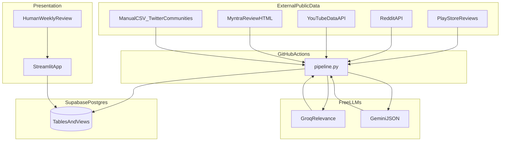
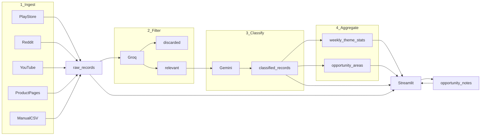
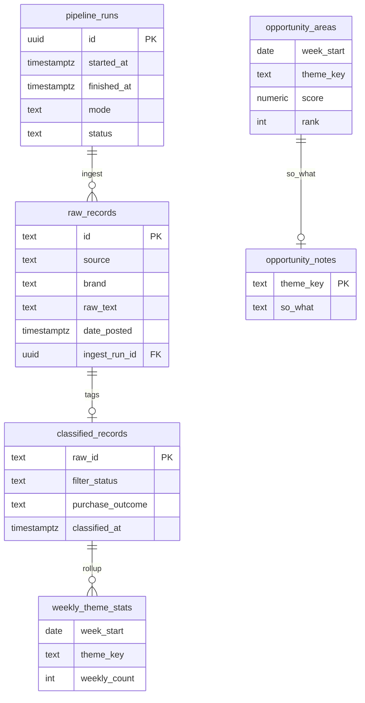
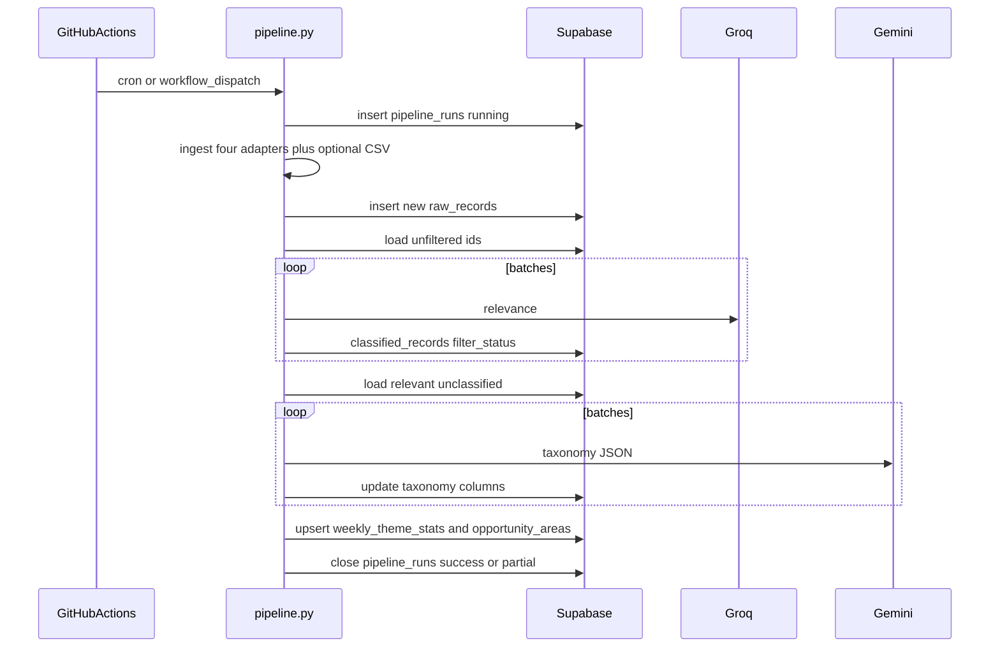

# Architecture — AI-Powered Discovery Engine

Companion to [`Context.md`](Context.md).

| Document | Job |
|---|---|
| `ProblemStatement.txt` | Original brief |
| `Context.md` | Why, metric, taxonomy, out of scope |
| `Architecture.md` | How it is built: components, data, jobs, dashboard, failure modes |
| `taxonomy.json` | Machine-readable enums (implementation artifact) |
| `methodology.md` | Sample size, coverage limits, tool tradeoffs (deliverable) |

**Focus: Myntra only.** AJIO, Nykaa, and other fashion marketplaces are out of scope. Do not scrape them, do not include them in keywords, and do not split the dashboard by competitor or by mention channel. The user problem does not change based on where it was mentioned.

Do not expand taxonomy, sources, or product scope beyond Context. This file specifies **mechanism**, not new questions.

---

## 1. Purpose and locked stack

The system is a **weekly batch discovery engine**. It turns public user text about **Myntra** shopping (wishlist, fit, price, reviews, returns) into **ranked, quantified opportunity areas** tied to a specific business metric: **wishlist-to-purchase conversion within 30 days** (`purchase_outcome`).

The 30-day window anchors what "conversion" means — a wishlisted product purchased within 30 days counts; beyond that, intent is likely stale.

It is not a chatbot, not a one-off report, and not a real-time monitor. It discovers problems, not solutions — **no monetary-incentive solutions are in scope**.

**Locked stack (free-tier only):**

| Layer | Choice | Why |
|---|---|---|
| Runtime | Python 3.11 | Scrapers, Groq, Gemini, Streamlit in one repo |
| Orchestration | GitHub Actions cron + `workflow_dispatch` | Free scheduled job; inspectable logs |
| Store | **Supabase (Postgres)** | Day-1 backfill will exceed Airtable’s free ~1,000-record cap; unique `id`; SQL rollups |
| Filter LLM | Groq (open models, free tier) | Cheap/fast relevance gate before Gemini |
| Classify LLM | Gemini (Google AI Studio free tier) | Structured JSON against fixed taxonomy |
| Dashboard | **Streamlit** (Community Cloud or local) | Same language as pipeline; filters, sparklines, editable notes |

Airtable is **not** in the design.

---

## 2. Design constraints (non-negotiable)

1. **Free tier only** — no paid APIs, no paid hosting, no paid LLM.
2. **Immutable raw text** — `raw_records.raw_text` is never updated or deleted by classification.
3. **Fixed taxonomy** — enums only from Context / `taxonomy.json`. No extra labels, no topic clustering.
4. **`segment_signal` is evidence-only** — tag only when the text states it; never infer gender, budget, or shopper type.
5. **Human “so what”** — `opportunity_notes.so_what` is written in weekly review, never by Groq or Gemini.
6. **Weekly freshness** — dashboard = last successful `pipeline_runs` row.
7. **Idempotent jobs** — re-running a week must not duplicate rows (`id` unique; upserts on rollup keys).
8. **Stated coverage limits** go in methodology, not treated as silent failures (Reddit ~1000/query; product pages have no archive; Twitter/communities are present-only).
9. **Myntra only** — drop or never insert text that is only about AJIO, Nykaa, or other retailers.
10. **Discovery, not solutions** — the engine identifies and ranks problems. No monetary-incentive solutions are in scope for the eventual product recommendation.
11. **30-day conversion window** — "conversion" means wishlisted → purchased within 30 days. This anchors the north-star metric.

**Explicitly out of scope:** AJIO, Nykaa, other marketplaces; platform/channel comparison views; predictive models; unsupervised clustering; algorithmic segment inference; PDF reports; real-time UI; Apple App Store scrape; monetary-incentive solutions.

---

## 3. System context



Actors:

- **GitHub Actions** runs `pipeline.py` on a schedule and on demand.
- **Reviewer** (you) opens Streamlit after each run and writes “so what” notes.
- **No end-user shopper** uses this product; it is an internal discovery tool.

---

## 4. End-to-end data flow



Quota-safe order is mandatory: **ingest → filter all new rows → classify only `relevant` → aggregate**. Never send discarded or unfiltered text to Gemini.

---

## 5. Logical architecture (modules)

`pipeline.py` is the only process GitHub Actions invokes. It is a thin orchestrator: open a run row, call stages, write counts, close the run even on failure.

| Path | Responsibility | Writes |
|---|---|---|
| `ingest/ids.py` | Canonical `id`, `source` | — |
| `ingest/play_store.py` | Myntra Play reviews only | `raw_records` |
| `ingest/reddit.py` | Subs + keyword search | `raw_records` |
| `ingest/youtube.py` | Comments on seed video IDs | `raw_records` |
| `ingest/product_pages.py` | Public review HTML | `raw_records` |
| `ingest/manual_csv.py` | Twitter / community top-up | `raw_records` |
| `filter/groq_filter.py` | Relevance JSON | `classified_records.filter_status` |
| `classify/gemini_classify.py` | Full taxonomy JSON | `classified_records` tags |
| `aggregate/themes.py` | Map a classified row → theme keys | — |
| `aggregate/weekly_rollup.py` | Counts, severity, trend, score, quotes | `weekly_theme_stats`, `opportunity_areas` |
| `app/streamlit_app.py` | Read views; edit notes | `opportunity_notes` |
| `config/settings.py` | Env, package names, subreddits, video IDs, URLs | — |
| `taxonomy.json` | Enums + descriptions for prompts | — |

Shared client: `db/supabase_client.py` (service role in Actions; anon or scoped key in Streamlit).

---

## 6. Ingestion design

### 6.1 Shared record contract

Every adapter upserts the same shape. Insert **only if `id` is new** (`ON CONFLICT (id) DO NOTHING`). Never patch `raw_text` on conflict.

| Field | Type | Rule |
|---|---|---|
| `id` | text PK | Stable, source-native where possible (see 6.2) |
| `source` | text | `play_store` \| `reddit` \| `youtube` \| `product_page` \| `twitter` \| `community` |
| `brand` | text | Always `myntra` for retained rows |
| `raw_text` | text | Body only; strip HTML; skip empty |
| `date_collected` | timestamptz | `now()` at insert |
| `date_posted` | timestamptz nullable | Source timestamp; null if unknown |
| `url` | text nullable | Permalink |
| `ingest_run_id` | uuid | Current `pipeline_runs.id` |
| `source_meta` | jsonb | Adapter leftovers (rating, subreddit, video_id, product_id) — not classified, used for debug and methodology |

Every retained row is **Myntra**. Adapters and the Groq filter must drop AJIO-only, Nykaa-only, and other-retailer-only text. There is no `ajio` platform split.

### 6.2 Canonical IDs (dedupe)

| Source | `id` format | Notes |
|---|---|---|
| Play Store | `play:{package}:{reviewId}` | `reviewId` from scraper |
| Reddit | `reddit:{fullname}` | e.g. `t1_...` comment or `t3_...` post; prefer comments/selftext that mention shopping |
| YouTube | `yt:{commentId}` | YouTube comment resource id |
| Product page | `pdp:myntra:{review_key}` | `review_key` = site review id if present, else SHA256 of `url + author + date + first 200 chars` hex[:24] |
| Twitter | `tw:{tweet_id}` | From the CSV |
| Community | `com:{sha256(url\|author\|date\|first200)[:24]}` | Threads rarely have stable ids |

### 6.3 Adapter behavior

**Play Store (`google-play-scraper`)**

- App: **Myntra Android package only** (config). Do not scrape AJIO or Nykaa.
- **Backfill:** paginate to the library’s / store’s available history.
- **Incremental:** paginate newest-first; stop after `K` consecutive pages whose review ids all exist in DB (default `K=2`) **or** after `max_pages` safety cap.
- Sleep between pages to stay polite and avoid blocks.
- Map review text + optional title into `raw_text`.

**Reddit (free API)**

- Targets: `r/IndianFashionAddicts`, `r/india`.
- Queries: always include **Myntra** (e.g. `Myntra`, `Myntra wishlist`, `Myntra size chart`, `Myntra return`, `Myntra vs`). Do not query AJIO or Nykaa. The `Myntra vs` keyword is included deliberately to catch cross-platform comparison mentions (users contrasting Myntra with other sites), which feeds `comparison_behavior: cross_platform_comparison`.
- **Hard ceiling:** ~1000 results per query — document actual pulled counts in `pipeline_runs` and methodology.
- Pull posts and comment bodies; one `raw_records` row per post or comment. Discard rows that are not about Myntra.
- Incremental: `created_utc` greater than last successful run’s max `date_posted` for `source=reddit`, plus id dedupe.

**YouTube Data API v3**

- Config: 10–15 seed **Myntra** haul/review video IDs (playlist or JSON list in repo). Not AJIO/Nykaa hauls.
- **Backfill:** all comment threads on those videos until quota or end.
- **Incremental:** `pageToken` not stored long-term; use comment `publishedAt` watermark + id dedupe.
- Respect daily quota; if quota exhausted, mark run `partial` and continue other sources.

**Product pages (public HTML)**

- Config: allowlisted **Myntra** product or listing URLs only (start small: a fixed set of high-review SKUs / category pages, not unbounded crawl). No AJIO or Nykaa hosts.
- Parse review blocks only; no login, no bypass of anti-bot beyond normal HTTP + delay + browser-like User-Agent.
- **Backfill:** everything currently on the page(s).
- **Incremental:** new `review_key`s only.
- Limitation: this is a **live snapshot**, not a historical archive.

**Manual CSV**

- Drop file under `data/manual/` or pass `--manual path.csv`.
- Required columns: `source` (`twitter`\|`community`), `raw_text`, `url`. Optional: `date_posted`, `id` (if omitted, hash as in 6.2). Rows must be about Myntra.
- Same filter → classify path as automated rows.

### 6.4 What is not ingested

- AJIO, Nykaa, and any non-Myntra retailer (Play apps, product pages, keyword queries).
- Apple App Store.
- Authenticated / paywalled group content.
- Images, video bytes (text comments only).
- Duplicate mirrors of the same `id`.

---

## 7. Filtering (Groq)

**Goal:** drop spam, ads, off-topic (unrelated politics, memes with no shopping content, “nice video”) so Gemini quota is spent on conversion-relevant text.

**Input:** `raw_records` with **no** `classified_records` row yet (left join).

**Output JSON (strict):**

```json
{
  "relevant": true,
  "reason": "mentions Myntra size chart and returns"
}
```

`relevant=true` when the text is about **Myntra** shopping: wishlist/shortlist/purchase/return/fit/price/reviews. `relevant=false` for spam, off-topic, or content only about AJIO, Nykaa, or other retailers.

**Write path:** insert `classified_records` with `filter_status` = `relevant` or `discarded`, all taxonomy columns null. Discarded rows **never** call Gemini.

**Ops:** batch in small groups (e.g. 1–5 texts per call depending on model context); exponential backoff on 429; cap `max_filter_per_run` so a huge backfill can be split across workflow_dispatch reruns (already-filtered ids are skipped).

---

## 8. Classification (Gemini)

**Input:** `classified_records` where `filter_status='relevant'` and `classified_at` is null.

**Prompt contract:**

- System: “Tag this user-generated text. Use only these enums. If the text does not say it, use `not_stated` / `not_mentioned` / `none_stated` / `unclear` / `not_evident`. Do not infer segment.”
- User: `raw_text` + `source` (brand is always Myntra).
- Response: **JSON only**, schema matching `taxonomy.json`.

**JSON object (one record):**

```json
{
  "purchase_outcome": "not_purchased",
  "wishlist_motive": "waiting_for_sale",
  "purchase_blocker": "size_fit_doubt",
  "post_selection_uncertainty": "fit_size",
  "purchase_postponement_reason": "waiting_for_discount",
  "comparison_behavior": "price_comparison",
  "external_info_sought": "youtube_review",
  "fit_size_signal": true,
  "styling_signal": false,
  "price_signal": true,
  "reviews_signal": false,
  "occasion_signal": false,
  "social_validation_signal": false,
  "wishlist_intent_type": "genuine_intent",
  "segment_signal": "not_evident",
  "unmet_need": "better size guide",
  "sentiment": "negative"
}
```

Validation: if a field is missing or not in the enum, coerce to the field’s unknown/not-stated value; log `validation_warnings` on the row. Do not invent new enum members.

**`unmet_need`:** short phrase or empty string. Store as submitted; aggregation normalizes (see §10.2).

**Retries:** 429/5xx backoff; after N failures, leave `classified_at` null so the next run retries. Do not mark discarded.

---

## 9. Data model (Supabase)

### 9.1 ER view



Primary keys for rollup tables: `(week_start, theme_key)`.

### 9.2 `pipeline_runs`

| Column | Type | Meaning |
|---|---|---|
| `id` | uuid PK | |
| `started_at` | timestamptz | |
| `finished_at` | timestamptz null | Set in `finally` |
| `mode` | text | `backfill` \| `incremental` |
| `status` | text | `running` \| `success` \| `partial` \| `failed` |
| `github_run_id` | text null | Actions run id |
| `log_url` | text null | Actions URL for graders |
| `counts` | jsonb | `{ingested, filtered_relevant, discarded, classified, classify_errors, themes}` |
| `error_summary` | text null | First fatal or list of partial errors |
| `watermark` | jsonb | Per-source max `date_posted` after this run |

`partial` = at least one source or LLM stage hit quota/error but others completed; aggregator still runs on whatever is classified.

### 9.3 `raw_records`

As §6.1. Indexes: `(source, date_posted)`, `(ingest_run_id)`. Unique: `id`. Check: `brand = 'myntra'`.

**Trigger or policy:** no `UPDATE` of `raw_text` (document in SQL; pipeline never issues that update).

### 9.4 `classified_records`

| Column | Type |
|---|---|
| `raw_id` | text PK FK → `raw_records.id` |
| `filter_status` | text `relevant` \| `discarded` |
| `filtered_at` | timestamptz |
| `filter_reason` | text null |
| `purchase_outcome` | text null |
| `wishlist_motive` | text null |
| `purchase_blocker` | text null |
| `post_selection_uncertainty` | text null |
| `purchase_postponement_reason` | text null |
| `comparison_behavior` | text null |
| `external_info_sought` | text null |
| `fit_size_signal` | boolean null |
| `styling_signal` | boolean null |
| `price_signal` | boolean null |
| `reviews_signal` | boolean null |
| `occasion_signal` | boolean null |
| `social_validation_signal` | boolean null |
| `wishlist_intent_type` | text null |
| `segment_signal` | text null |
| `unmet_need` | text null |
| `sentiment` | text null |
| `classified_at` | timestamptz null |
| `model_filter` | text null |
| `model_classify` | text null |
| `validation_warnings` | jsonb null |

Check constraints: enum lists matching `taxonomy.json` (or validate in Python if you want simpler migrations).

### 9.5 `weekly_theme_stats`

| Column | Type | Meaning |
|---|---|---|
| `week_start` | date | Monday UTC of ISO week |
| `theme_key` | text | e.g. `purchase_blocker:size_fit_doubt` |
| `theme_field` | text | e.g. `purchase_blocker` |
| `theme_value` | text | e.g. `size_fit_doubt` |
| `weekly_count` | int | Distinct `raw_id` this week |
| `cumulative_count` | int | Distinct `raw_id` through this week |
| `wow_pct` | numeric null | `(this - prior) / prior` if prior > 0 |
| `count_play_store` … | int | Per-`source` mix (Play, Reddit, YouTube, PDP, twitter, community) |
| `purchased_n` | int | Theme rows with `purchase_outcome=purchased` |
| `not_purchased_n` | int | |
| `unclear_n` | int | |

Week assignment: `date_trunc('week', coalesce(date_posted, date_collected) at time zone 'utc')::date` (Postgres week = Monday).

### 9.6 `opportunity_areas`

| Column | Type |
|---|---|
| `week_start` | date |
| `theme_key` | text |
| `frequency` | int | Same as `weekly_count` |
| `severity` | int | 1–3 |
| `neg_not_purchased_rate` | numeric | See §10.3 |
| `trend` | text | `rising` \| `flat` \| `falling` |
| `trend_multiplier` | numeric | 1.2 / 1.0 / 0.8 |
| `score` | numeric | `frequency * severity * trend_multiplier` |
| `rank` | int | 1 = highest score that week |
| `priority` | boolean | rank ≤ 3 **or** score ≥ that week’s 75th percentile |
| `quote_raw_ids` | text[] | Up to 5 evidence ids |

Unique `(week_start, theme_key)`. Replace-on-run for that `week_start` (delete+insert or upsert).

### 9.7 `opportunity_notes`

| Column | Type |
|---|---|
| `theme_key` | text PK |
| `so_what` | text | Human sentence |
| `updated_at` | timestamptz |
| `updated_by` | text null | Optional initials |

Notes persist across weeks (same theme keeps the implication until edited). Dashboard shows the note next to the **current** week’s rank.

### 9.8 Views for Streamlit

- `v_latest_week` — max `week_start` where `pipeline_runs.status` in (`success`,`partial`) and rollup exists.
- `v_opportunity_board` — `opportunity_areas` ⋈ `weekly_theme_stats` ⋈ `opportunity_notes` for that week.
- `v_quotes` — unnest `quote_raw_ids` ⋈ `raw_records` (text, url, source).

---

## 10. Aggregation

Runs after classify. Uses **only** rows with `filter_status='relevant'` and `classified_at` not null. **Not** an LLM step.

### 10.1 Theme keys (explode one record to many themes)

A single classified row can contribute to multiple themes.

| Rule | `theme_key` | Skip if |
|---|---|---|
| Enum fields | `{field}:{value}` | value is `not_stated`, `not_mentioned`, `none_stated`, `unclear` (for `purchase_outcome`, **do not skip** — conversion mix is required) |
| Boolean signals | `{signal}:true` | `false` or null |
| `unmet_need` | `unmet_need:{normalized}` | empty after normalize |
| `segment_signal` | `segment_signal:{value}` | `not_evident` |

`purchase_outcome` is **not** ranked as an “opportunity theme” by itself. It is stored on stats as `purchased_n` / `not_purchased_n` / `unclear_n` **for each other theme** so the board can show conversion impact.

`sentiment` is not a ranked theme; it only feeds severity.

### 10.2 `unmet_need` normalize

Lowercase, strip, collapse whitespace, strip trailing punctuation. Count exact normalized strings. This is **not** clustering. Rare one-off phrases still appear; the board can hide themes with `weekly_count < min_count` (default 2) so noise does not dominate.

### 10.3 Severity (1–3)

For each `(week_start, theme_key)`:

- `S` = distinct records that carry that theme that week
- `N` = subset with `purchase_outcome = not_purchased` **and** `sentiment = negative`
- `rate = |N| / |S|` (0 if `|S|=0`, drop theme)

| `rate` | `severity` |
|---|---|
| ≥ 0.50 | 3 |
| ≥ 0.20 and &lt; 0.50 | 2 |
| &lt; 0.20 | 1 |

This is the automatic co-occurrence rule from Context — no hand scoring.

### 10.4 Trend multiplier

Compare this week’s `frequency` to **prior week’s** `frequency` for the same `theme_key` (if no prior row, treat prior as 0).

Deadband: relative change within ±10% → `flat`.

| Condition | `trend` | Multiplier |
|---|---|---|
| prior = 0 and current > 0 | `rising` | 1.2 |
| current > prior × 1.10 | `rising` | 1.2 |
| current &lt; prior × 0.90 | `falling` | 0.8 |
| else | `flat` | 1.0 |

`wow_pct` = `(current - prior) / prior` when prior > 0, else null.

### 10.5 Opportunity score and rank

```text
score = frequency × severity × trend_multiplier
```

Rank by `score` desc, tie-break `frequency` desc, then `theme_key` asc.

`priority = true` if `rank <= 3` OR `score >= percentile_75(score)` that week.

### 10.6 Representative quotes

For each theme, pick up to **5** `raw_id`s:

1. Must be in `S` for that week.
2. Prefer `not_purchased` + `negative`.
3. Prefer length 80–400 characters.
4. Diversify `source` (round-robin) so the board is not only Play Store.
5. Stable sort: those preferences then `id` so reruns stay stable.

Store ids only; Streamlit joins text at read time.

### 10.7 Conversion link (dashboard metric)

Per theme, show:

```text
not_purchased_share = not_purchased_n / (purchased_n + not_purchased_n + unclear_n)
```

This is the explicit tie from theme → Myntra wishlist-to-purchase, using tagged `purchase_outcome`, not Myntra’s internal funnel API (we do not have that data).

---

## 11. Pipeline runtime

### 11.1 Sequence



CLI:

```text
python pipeline.py --mode backfill
python pipeline.py --mode incremental
python pipeline.py --mode incremental --manual data/manual/week3.csv
python pipeline.py --stage aggregate   # recompute scores without scraping
```

First run in an empty DB uses `--mode backfill`. Later scheduled runs use `incremental`.

### 11.2 GitHub Actions

File: `.github/workflows/weekly-pipeline.yml`

- `on.schedule`: `cron: "0 3 * * 1"` (Monday 03:00 UTC) — weekly by design.
- `on.workflow_dispatch`: inputs `mode` = backfill \| incremental.
- Runner: `ubuntu-latest`, Python 3.11, `pip install -r requirements.txt`.
- Secrets: listed in §13.
- Step that prints a **run summary** (counts JSON) so the Actions log is the “proof of repeated operation” deliverable.
- `concurrency: pipeline` so two crons cannot interleave writes.

Public repo: never echo secrets. Scrapers must tolerate a world-readable workflow file (Myntra package name, subreddit names, Myntra video ids can live in `config/sources.json` in git; keys cannot).

### 11.3 Failure and idempotency

| Failure | Behavior |
|---|---|
| One scraper 403/timeout | Log, continue others, `status=partial` |
| Groq quota | Stop filter; remaining rows stay unfiltered; next run resumes |
| Gemini quota | Stop classify; aggregator uses already-classified; `partial` |
| Supabase outage | `failed`; no fake success |
| Invalid JSON from Gemini | Retry once; then leave unclassified |

Idempotency: raw insert ignore duplicates; filter/classify select work queues by null timestamps; rollup upserts by `(week_start, theme_key)`.

---

## 12. Presentation (Streamlit)

No new pipeline stages. Reads the latest weekly rollup; writes only `opportunity_notes`. Weekly refresh — not real-time.

**Header:** last run id, `finished_at`, `status`, “data as of {week_start}”. Myntra only.

**Controls (above the list):**

1. **This week / All time** — This week uses `weekly_count` as frequency and the stored weekly `score`. All time uses `cumulative_count` as frequency and `score = cumulative_count × severity × trend_multiplier` (same severity and trend already on the row; no new model). Re-rank the visible list by that score.
2. **View by question** — client-side filter on `theme_field` (taxonomy category). Options:
   - All questions
   - What prevents a purchase? → `purchase_blocker`
   - Why do users wishlist? → `wishlist_motive`
   - What uncertainties remain? → `post_selection_uncertainty`
   - How do users compare products? → `comparison_behavior`
   - What info do users seek elsewhere? → `external_info_sought`
   Other taxonomy fields still appear under All questions only.

**Not in the UI:** platform toggle, AJIO, channel comparison (Play vs Reddit vs YouTube vs PDP), source mix charts, sparklines, conversion stacked bars, PDF export, auto-refresh.

**Each opportunity card/row:**

| UI | Data |
|---|---|
| Rank | display rank in the current filter + period |
| Theme name | humanize `theme_field` + `theme_value` |
| Priority badge | only if `priority` is true (rank ≤ 3 **or** weekly score ≥ that week’s 75th percentile, as stored) |
| Opportunity score | Frequency × Severity × Trend Multiplier for the selected period |
| Trend | ↑ / → / ↓ from `trend` (WoW % change). Arrow only — no sparkline |
| Mention count | `weekly_count` or `cumulative_count` |
| Quote | first representative verbatim `raw_text` |
| So what | plain text field bound to `opportunity_notes` — human-written, not AI-generated |

Until Supabase is connected, the app may read a local fixture (`app/sample_board.json`) and persist notes to `data/opportunity_notes.json`.

Hosting: Streamlit Community Cloud or local `streamlit run app/streamlit_app.py`.

---

## 13. Security, secrets, RLS

| Secret | Where | Use |
|---|---|---|
| `SUPABASE_URL` | GHA + Streamlit | API |
| `SUPABASE_SERVICE_ROLE_KEY` | GHA only | Writes; never in the browser |
| `SUPABASE_ANON_KEY` | Streamlit | Reads; notes write via RPC or authenticated policy |
| `GROQ_API_KEY` | GHA | Filter |
| `GEMINI_API_KEY` | GHA | Classify |
| `REDDIT_CLIENT_ID` / `REDDIT_CLIENT_SECRET` / `REDDIT_USER_AGENT` | GHA | Ingest |
| `YOUTUBE_API_KEY` | GHA | Ingest |

**RLS sketch:**

- `raw_records`, `classified_records`, stats, opportunities: `SELECT` for `anon`; no `anon` insert/update/delete.
- `opportunity_notes`: `SELECT` for `anon`; `UPDATE`/`INSERT` for a single dashboard role **or** Streamlit uses a constrained Edge Function. If Community Cloud cannot do user auth, use a Streamlit secret `NOTES_WRITE_KEY` checked in the app before calling a service-side function — do not embed the service role in the client repo.

Do not commit `.env`. Example `.env.example` only.

Play/YouTube/Reddit keys stay in Actions. Product scrape: no keys.

---

## 14. Free-tier operating envelope

Document actual usage in methodology after week 1. Design caps (config, adjustable):

| Resource | Conservative default |
|---|---|
| Gemini classify per run | `max_classify_per_run` (e.g. 300) |
| Groq filter per run | `max_filter_per_run` (e.g. 800) |
| YouTube | stop on quota error; resume next week |
| Reddit | stop at API cap per query |
| Product pages | fixed URL list; 1–2s delay |
| GitHub Actions | one weekly job; keep under ~30–45 min; split backfill via multiple `workflow_dispatch` |

Backfill may take **several manual dispatches**; each resume skips done ids.

---

## 15. Observability

Every run logs (stdout = Actions log):

- Per source: fetched, inserted, skipped_duplicate, error
- Filter: relevant, discarded, errors
- Classify: success, invalid_json, errors
- Aggregate: theme count, top 5 keys by score
- Duration

Persist the same in `pipeline_runs.counts`. No third-party APM (out of free-tier simplicity).

---

## 16. Testing (implementation, not extra product)

- Unit: ID canonicalization, theme explode, severity/trend/score, unmet_need normalize.
- Fixture JSON: fake Gemini payloads → DB-shaped dicts.
- No requirement to hit live Myntra in CI (scrapers are integration, run locally).

---

## 17. Proposed repo layout

```text
.
├── Context.md
├── Architecture.md
├── ProblemStatement.txt
├── taxonomy.json
├── methodology.md
├── requirements.txt
├── .env.example
├── config/
│   ├── settings.py
│   └── sources.json          # Myntra Play package, subreddits, Myntra video ids, Myntra pdp urls
├── db/
│   ├── supabase_client.py
│   └── schema.sql            # tables, indexes, views
├── ingest/
│   ├── ids.py
│   ├── play_store.py
│   ├── reddit.py
│   ├── youtube.py
│   ├── product_pages.py
│   └── manual_csv.py
├── filter/
│   └── groq_filter.py
├── classify/
│   └── gemini_classify.py
├── aggregate/
│   ├── themes.py
│   └── weekly_rollup.py
├── app/
│   └── streamlit_app.py
├── data/
│   └── manual/               # gitignore contents except .gitkeep
├── pipeline.py
└── .github/workflows/weekly-pipeline.yml
```

---

## 18. Suggested build order

1. `taxonomy.json` + `db/schema.sql` + empty Supabase project  
2. `ingest/play_store.py` + id dedupe (largest, most reliable text)  
3. Groq filter + Gemini classify on a **sample** of rows (prove JSON schema)  
4. `weekly_rollup.py` + score unit tests  
5. Streamlit board + notes  
6. Remaining scrapers + Actions cron  
7. Manual CSV + methodology note with real counts  

---

## 19. Mapping to brief questions

| Brief question | Primary fields on the board |
|---|---|
| Why add to wishlist | `wishlist_motive:*` |
| What blocks purchase | `purchase_blocker:*` |
| Post-selection uncertainty | `post_selection_uncertainty:*` |
| Postponement | `purchase_postponement_reason:*` |
| Comparison | `comparison_behavior:*` |
| Info sought outside Myntra | `external_info_sought:*` |
| Fit, style, price, reviews, occasion, social | `*_signal:true` |
| Intent vs bookmark | `wishlist_intent_type:*` |
| Segments | `segment_signal:*` (explicit only) |
| Recurring unmet needs | `unmet_need:*` |
| Tied to conversion | `purchase_outcome` mix + severity on every theme |
