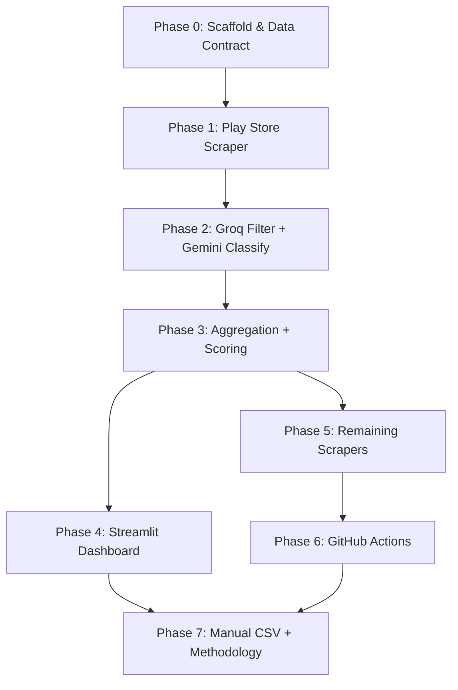

# Implementation Plan — AI-Powered Discovery Engine

Phased build plan derived from [Context.md](Context.md) and [Architecture.md](Architecture.md).

Each phase is designed to produce a **testable, runnable output** before moving on. Dependencies flow downward — no phase requires anything from a later phase.

---

## Phase 0 — Project Scaffold & Data Contract

**Goal:** Establish the repo structure, taxonomy schema, database, and shared utilities so every later phase writes to the same contract.

### 0.1 Repo skeleton

Create the directory structure from Architecture §17:

```text
.
├── config/
│   ├── settings.py              # env loading, source config constants
│   └── sources.json             # Myntra Play package, subreddits, video ids, pdp urls
├── db/
│   ├── supabase_client.py       # shared Supabase client (service role in Actions, anon in Streamlit)
│   └── schema.sql               # tables, indexes, views, RLS policies
├── ingest/
│   ├── ids.py                   # canonical ID generation per source (§6.2)
│   ├── play_store.py
│   ├── reddit.py
│   ├── youtube.py
│   ├── product_pages.py
│   └── manual_csv.py
├── filter/
│   └── groq_filter.py
├── classify/
│   └── gemini_classify.py
├── aggregate/
│   ├── themes.py                # explode classified row → theme keys
│   └── weekly_rollup.py         # counts, severity, trend, score, quotes
├── app/
│   ├── streamlit_app.py
│   └── sample_board.json        # local fixture until Supabase is connected
├── data/
│   └── manual/                  # .gitkeep; manual CSV top-ups go here
├── tests/
│   └── ...                      # unit tests per phase
├── pipeline.py                  # thin orchestrator; CLI entry point
├── requirements.txt
├── .env.example
├── .gitignore
├── Context.md
├── Architecture.md
├── ProblemStatement.txt
├── Implementation_plan.md
└── .github/workflows/weekly-pipeline.yml
```

### 0.2 `taxonomy.json`

Machine-readable copy of the full classification taxonomy (Context §Classification taxonomy). Contains:
- All enum fields with their allowed values and null/unknown defaults
- Boolean signal fields
- `unmet_need` as open short-text
- `sentiment` as supporting field

This file is the **single source of truth** for prompt construction, Gemini response validation, and DB check constraints.

### 0.3 `config/settings.py` & `config/sources.json`

- `settings.py` — loads env vars (`SUPABASE_URL`, `SUPABASE_SERVICE_ROLE_KEY`, `GROQ_API_KEY`, `GEMINI_API_KEY`, `REDDIT_CLIENT_ID`, `REDDIT_CLIENT_SECRET`, `REDDIT_USER_AGENT`, `YOUTUBE_API_KEY`), plus tuning knobs (`max_filter_per_run`, `max_classify_per_run`, `min_count` for board display).
- `sources.json` — Myntra Play Store package name, target subreddits (`IndianFashionAddicts`, `india`), Reddit search queries (`Myntra`, `Myntra wishlist`, `Myntra size chart`, `Myntra return`, `Myntra vs`), seed YouTube video IDs (10–15), Myntra PDP URLs to scrape.
- `.env.example` — all secrets with placeholder values, never real keys.

### 0.4 `db/schema.sql` & Supabase project

Create an empty Supabase project (free tier). Write `schema.sql` containing:

| Table | Key columns | Notes |
|---|---|---|
| `pipeline_runs` | `id` uuid PK, `started_at`, `finished_at`, `mode`, `status`, `counts` jsonb, `watermark` jsonb | §9.2 |
| `raw_records` | `id` text PK, `source`, `brand` (check = `myntra`), `raw_text`, `date_posted`, `ingest_run_id` FK | §9.3; unique `id`; `ON CONFLICT DO NOTHING` |
| `classified_records` | `raw_id` text PK FK, `filter_status`, taxonomy columns (all nullable), `classified_at` | §9.4 |
| `weekly_theme_stats` | `(week_start, theme_key)` PK, `weekly_count`, `cumulative_count`, `wow_pct`, per-source counts, `purchased_n`/`not_purchased_n`/`unclear_n` | §9.5 |
| `opportunity_areas` | `(week_start, theme_key)` PK, `frequency`, `severity`, `trend`, `score`, `rank`, `priority`, `quote_raw_ids` | §9.6 |
| `opportunity_notes` | `theme_key` text PK, `so_what`, `updated_at` | §9.7 |

Views: `v_latest_week`, `v_opportunity_board`, `v_quotes` (§9.8).

RLS policies: `SELECT` for `anon` on all tables; write-restricted `opportunity_notes` (§13).

### 0.5 `db/supabase_client.py`

Shared client module:
- Accepts `SUPABASE_URL` + key from env.
- Pipeline uses service role key; Streamlit uses anon key.
- Exposes helper methods: `upsert_raw`, `insert_classified`, `upsert_rollup`, etc.

### 0.6 `ingest/ids.py`

Canonical ID functions per source (Architecture §6.2):

| Source | Format |
|---|---|
| Play Store | `play:{package}:{reviewId}` |
| Reddit | `reddit:{fullname}` |
| YouTube | `yt:{commentId}` |
| Product page | `pdp:myntra:{review_key}` |
| Twitter | `tw:{tweet_id}` |
| Community | `com:{sha256(url|author|date|first200)[:24]}` |

### 0.7 `.gitignore`

Exclude: `.env`, `data/manual/*` (keep `.gitkeep`), `__pycache__`, `.venv`, `.streamlit/secrets.toml`.

### 0.8 `requirements.txt`

Pin all dependencies: `google-play-scraper`, `praw`, `google-api-python-client`, `requests`, `beautifulsoup4`, `supabase`, `groq`, `google-generativeai`, `streamlit`, `pandas`, `python-dotenv`.

**Phase 0 exit criteria:**
- `python -c "from config.settings import *"` succeeds
- `schema.sql` runs on Supabase without errors
- `db/supabase_client.py` can connect and read an empty table
- `ingest/ids.py` unit tests pass for all 6 formats
- `taxonomy.json` validates against a JSON schema

---

## Phase 1 — First Scraper (Play Store) + ID Dedupe

**Goal:** Prove the ingest loop end-to-end with the single richest source.

### 1.1 `ingest/play_store.py`

- Scrape Myntra Android package only (from `sources.json`).
- **Backfill mode:** paginate to full available history.
- **Incremental mode:** paginate newest-first; stop after `K=2` consecutive pages of all-duplicate IDs, or `max_pages` cap.
- Sleep between pages (politeness + block avoidance).
- Map `review text + optional title` → `raw_text`.
- Generate canonical ID via `ids.py`.
- Upsert into `raw_records` via `supabase_client` (`ON CONFLICT DO NOTHING`).
- Store `source_meta`: `{rating, thumbsUpCount, at}`.

### 1.2 `pipeline.py` (skeleton)

Thin orchestrator with CLI:
```
python pipeline.py --mode backfill
python pipeline.py --mode incremental
python pipeline.py --stage aggregate
```

For Phase 1: only calls Play Store ingest. Opens a `pipeline_runs` row (`status=running`), calls the adapter, writes `counts`, closes the row (`success` / `partial` / `failed`).

### 1.3 Verification

- Run backfill locally; confirm rows in Supabase `raw_records`.
- Run incremental immediately after; confirm zero new inserts (all dupes).
- Check `pipeline_runs` row has correct counts.

**Phase 1 exit criteria:**
- `raw_records` has real Play Store data in Supabase
- Duplicate re-runs insert 0 new rows
- `pipeline_runs` row records counts accurately

---

## Phase 2 — Groq Filter + Gemini Classification (Sample Proof)

**Goal:** Prove both LLM stages work on a small sample, validate JSON schema round-trip, and establish the filter→classify gate.

### 2.1 `filter/groq_filter.py`

- Select `raw_records` with no `classified_records` row (left join null).
- Batch 1–5 texts per Groq call.
- Prompt: "Is this text about Myntra shopping (wishlist/shortlist/purchase/return/fit/price/reviews)? Reply JSON `{relevant: bool, reason: string}`."
- `relevant=true` → insert `classified_records` row with `filter_status='relevant'`, all taxonomy columns null.
- `relevant=false` → insert with `filter_status='discarded'`. **Discarded rows never reach Gemini.**
- Exponential backoff on 429.
- Cap at `max_filter_per_run`.

### 2.2 `classify/gemini_classify.py`

- Select `classified_records` where `filter_status='relevant'` and `classified_at IS NULL`.
- System prompt: "Tag this user-generated text. Use only these enums: {taxonomy.json}. If not stated, use the field's unknown value. Do not infer segment."
- User prompt: `raw_text` + `source` (brand is always Myntra).
- Response: strict JSON matching `taxonomy.json` schema.
- Validate response against enum lists; coerce missing/invalid fields to unknown defaults; log `validation_warnings`.
- Write taxonomy columns + `classified_at` + `model_classify`.
- Retry on 429/5xx with backoff; after N failures, leave `classified_at` null (next run retries).
- Cap at `max_classify_per_run`.

### 2.3 Wire into `pipeline.py`

Add filter and classify stages after ingest. Sequence: ingest → filter all new → classify only relevant.

### 2.4 Verification

- Run pipeline on ~50 rows from Phase 1 data.
- Check `classified_records`: mix of `relevant` and `discarded`.
- Check taxonomy columns are populated and valid for relevant rows.
- Confirm discarded rows have null taxonomy columns.
- Confirm `validation_warnings` fires on any bad Gemini output.

**Phase 2 exit criteria:**
- Filter correctly gates: discarded rows never call Gemini
- Classified rows have valid taxonomy JSON matching `taxonomy.json`
- Retry/backoff handles 429 gracefully
- `pipeline_runs.counts` shows filter + classify numbers

---

## Phase 3 — Aggregation Engine + Score Unit Tests

**Goal:** Build the rollup logic that turns classified rows into ranked, scored opportunity areas.

### 3.1 `aggregate/themes.py`

Theme key explosion (Architecture §10.1):

- Enum fields → `{field}:{value}`, skip `not_stated`/`not_mentioned`/`none_stated`/`unclear` (except `purchase_outcome` — never skip).
- Boolean signals → `{signal}:true`, skip `false`/null.
- `unmet_need` → `unmet_need:{normalized}`, skip empty.
- `segment_signal` → `segment_signal:{value}`, skip `not_evident`.
- `purchase_outcome` is **not** ranked as a theme — stored as `purchased_n`/`not_purchased_n`/`unclear_n` per other theme.
- `sentiment` is not a ranked theme — only feeds severity.

### 3.2 `unmet_need` normalization

Lowercase, strip, collapse whitespace, strip trailing punctuation. Count exact normalized strings. No clustering.

### 3.3 Severity calculation (§10.3)

For each `(week_start, theme_key)`:
- `S` = records carrying this theme this week
- `N` = subset where `purchase_outcome=not_purchased` AND `sentiment=negative`
- `rate = |N| / |S|`

| Rate | Severity |
|---|---|
| ≥ 0.50 | 3 |
| ≥ 0.20 and < 0.50 | 2 |
| < 0.20 | 1 |

### 3.4 Trend & multiplier (§10.4)

Compare this week's frequency to prior week's. Deadband ±10%.

| Condition | Trend | Multiplier |
|---|---|---|
| prior = 0 and current > 0 | rising | 1.2 |
| current > prior × 1.10 | rising | 1.2 |
| current < prior × 0.90 | falling | 0.8 |
| else | flat | 1.0 |

`wow_pct = (current - prior) / prior` when prior > 0, else null.

### 3.5 Score, rank, priority (§10.5)

```
score = frequency × severity × trend_multiplier
```

Rank by `score` desc → `frequency` desc → `theme_key` asc.

`priority = true` if `rank ≤ 3` OR `score ≥ 75th percentile` that week.

### 3.6 Representative quotes (§10.6)

Up to 5 `raw_id`s per theme:
1. Must be in `S` for that week
2. Prefer `not_purchased` + `negative`
3. Prefer length 80–400 chars
4. Diversify `source` (round-robin)
5. Stable sort (preferences then `id`)

Store IDs only — Streamlit joins text at read time.

### 3.7 `aggregate/weekly_rollup.py`

Orchestrates 3.1–3.6. Upserts into `weekly_theme_stats` and `opportunity_areas`.

### 3.8 Unit tests

- ID canonicalization (from Phase 0)
- Theme explosion (enum, boolean, unmet_need, edge cases)
- Severity at boundary rates (0.19, 0.20, 0.49, 0.50)
- Trend (prior=0, rising, flat, falling, deadband boundaries)
- Score = frequency × severity × multiplier
- Rank tie-breaking
- Priority threshold (rank ≤ 3 and percentile)
- `unmet_need` normalization (whitespace, punctuation, casing)

### 3.9 Wire into `pipeline.py`

Add aggregate stage after classify. Full sequence: ingest → filter → classify → aggregate.

**Phase 3 exit criteria:**
- `weekly_theme_stats` and `opportunity_areas` populated from classified data
- All unit tests pass
- Score matches manual calculation on sample rows
- Themes exclude `not_stated`/`not_mentioned` defaults (except `purchase_outcome`)
- `pipeline_runs.counts` includes theme count

---

## Phase 4 — Streamlit Dashboard + Notes

**Goal:** Build the presentation layer that reads rollup data and lets the reviewer write "so what" notes.

### 4.1 Core layout

- **Header:** last run `id`, `finished_at`, `status`, "data as of {week_start}". Myntra branding.
- **Controls:**
  - **This week / All time** toggle — This week uses `weekly_count`; All time uses `cumulative_count`. Score recalculated for selected period. Re-rank visible list.
  - **View by question** — filter on `theme_field`:
    - All questions
    - What prevents a purchase? → `purchase_blocker`
    - Why do users wishlist? → `wishlist_motive`
    - What uncertainties remain? → `post_selection_uncertainty`
    - How do users compare products? → `comparison_behavior`
    - What info do users seek elsewhere? → `external_info_sought`
    - Other fields appear under "All questions" only.

### 4.2 Opportunity card/row

| UI element | Data source |
|---|---|
| Rank | display rank in current filter + period |
| Theme name | humanize `theme_field` + `theme_value` |
| Priority badge | only if `priority=true` |
| Opportunity score | `frequency × severity × trend_multiplier` |
| Trend arrow | ↑ / → / ↓ from `trend` |
| Mention count | `weekly_count` or `cumulative_count` |
| Quote | first representative verbatim `raw_text` |
| So what | plain text field → `opportunity_notes` (human-written, not AI) |

### 4.3 Local fixture fallback

Until Supabase is connected, read from `app/sample_board.json` and persist notes to `data/opportunity_notes.json`. Switch to Supabase views (`v_opportunity_board`, `v_quotes`) when available.

### 4.4 Notes persistence

- `opportunity_notes` table: `theme_key` PK, `so_what`, `updated_at`.
- Notes persist across weeks — same theme keeps its note until edited.
- Write via constrained RPC or `NOTES_WRITE_KEY` secret (never expose service role in client).

### 4.5 What is NOT in the UI

Platform/channel comparison, AJIO, source mix charts, sparklines, conversion stacked bars, PDF export, auto-refresh.

**Phase 4 exit criteria:**
- `streamlit run app/streamlit_app.py` renders the board with fixture data
- Question filter works correctly
- This week / All time toggle recalculates scores and re-ranks
- Notes save and persist across page reloads
- Priority badges appear on correct rows

---

## Phase 5 — Remaining Scrapers

**Goal:** Add Reddit, YouTube, and product page scrapers to complete the automated data collection.

### 5.1 `ingest/reddit.py`

- Use `praw` (Reddit API, free tier).
- Targets: `r/IndianFashionAddicts`, `r/india`.
- Queries: `Myntra`, `Myntra wishlist`, `Myntra size chart`, `Myntra return`, `Myntra vs`.
- Pull posts and comment bodies; one `raw_records` row per post/comment.
- Discard rows not about Myntra.
- **Backfill:** up to ~1000 results per query.
- **Incremental:** `created_utc` > last run's max `date_posted` for `source=reddit`, plus ID dedupe.
- Canonical ID: `reddit:{fullname}`.
- Document actual pulled counts in `pipeline_runs` and methodology.

### 5.2 `ingest/youtube.py`

- Use YouTube Data API v3 (free quota).
- Config: 10–15 seed Myntra haul/review video IDs from `sources.json`.
- **Backfill:** all comment threads until quota or end.
- **Incremental:** `publishedAt` watermark + ID dedupe.
- Respect daily quota; if exhausted, mark run `partial` and continue other sources.
- Canonical ID: `yt:{commentId}`.

### 5.3 `ingest/product_pages.py`

- Config: fixed list of Myntra product/listing URLs from `sources.json`.
- Public HTML scrape with `requests` + `BeautifulSoup`.
- Parse review blocks only; browser-like User-Agent + 1–2s delay between pages.
- No login, no anti-bot bypass beyond normal HTTP.
- **Backfill:** everything currently on the page(s).
- **Incremental:** new `review_key`s only.
- Canonical ID: `pdp:myntra:{review_key}` (site review ID if present, else SHA256 hash).
- Stated limitation: live snapshot, not historical archive.

### 5.4 Wire into `pipeline.py`

Update orchestrator to call all four adapters. Each adapter failure: log, continue others, `status=partial`.

### 5.5 Verification

- Run each scraper individually in backfill mode.
- Confirm `raw_records` has data from all four sources.
- Run incremental; confirm only new items inserted.
- Check `pipeline_runs.counts` per source.

**Phase 5 exit criteria:**
- All 4 scrapers produce real data in Supabase
- Incremental mode correctly dedupes
- One scraper failure doesn't block others (`partial` status)
- `source` column correctly identifies origin

---

## Phase 6 — GitHub Actions + Automation

**Goal:** Automate the full pipeline as a scheduled weekly job.

### 6.1 `.github/workflows/weekly-pipeline.yml`

- `on.schedule`: `cron: "0 3 * * 1"` (Monday 03:00 UTC).
- `on.workflow_dispatch`: input `mode` = `backfill` | `incremental`.
- Runner: `ubuntu-latest`, Python 3.11.
- Steps: checkout → setup Python → install `requirements.txt` → run `pipeline.py`.
- Secrets from GitHub repo settings (§13): `SUPABASE_URL`, `SUPABASE_SERVICE_ROLE_KEY`, `GROQ_API_KEY`, `GEMINI_API_KEY`, `REDDIT_CLIENT_ID`, `REDDIT_CLIENT_SECRET`, `REDDIT_USER_AGENT`, `YOUTUBE_API_KEY`.
- Print run summary (counts JSON) in Actions log — this is the "proof of repeated operation" deliverable.
- `concurrency: pipeline` to prevent interleaved writes.

### 6.2 Initial backfill via workflow_dispatch

Backfill may take **several manual dispatches** due to free-tier quotas. Each dispatch resumes where the prior one stopped (already-processed IDs are skipped).

### 6.3 Security

- Never echo secrets in logs.
- Non-secret config (`sources.json`) lives in git; keys stay in GitHub Secrets.
- `.env` is `.gitignore`d; only `.env.example` is committed.

**Phase 6 exit criteria:**
- `workflow_dispatch` with `mode=backfill` runs successfully
- Scheduled cron fires on Monday 03:00 UTC
- Secrets are not logged
- Pipeline completes with `success` or `partial` (never `failed` due to config issues)

---

## Phase 7 — Manual CSV + Methodology + Polish

**Goal:** Complete the system with manual data support, documentation, and final hardening.

### 7.1 `ingest/manual_csv.py`

- Drop file under `data/manual/` or pass `--manual path.csv`.
- Required columns: `source` (`twitter` | `community`), `raw_text`, `url`.
- Optional: `date_posted`, `id` (if omitted, hash per §6.2).
- Rows must be about Myntra.
- Same filter → classify path as automated rows.

### 7.2 `methodology.md`

Document:
- Data sources and their APIs
- Sample sizes (actual counts after week 1)
- Taxonomy rationale — why each field exists, mapped to brief questions
- Tool tradeoffs (Groq for filter vs. Gemini for classify)
- Free-tier operating envelope with actual usage numbers
- Stated coverage limitations:
  - Reddit ~1000/query ceiling
  - Product pages = live snapshot, not historical
  - Twitter/communities = manual, present-only
  - Apple App Store excluded (Android-first)
  - AJIO/Nykaa excluded (scoping decision)

### 7.3 Dashboard → Supabase connection

Switch Streamlit from local fixture to live Supabase views:
- `v_opportunity_board` for the main list
- `v_quotes` for quote text
- `opportunity_notes` for so-what persistence

### 7.4 Observability polish

Ensure `pipeline_runs.counts` captures per-source breakdown:
- Per source: fetched, inserted, skipped_duplicate, error
- Filter: relevant, discarded, errors
- Classify: success, invalid_json, errors
- Aggregate: theme count, top 5 keys by score
- Duration

### 7.5 Final unit tests

Round out test coverage:
- `manual_csv.py` parsing and ID generation
- End-to-end fixture test (fake data → rollup → board JSON)

**Phase 7 exit criteria:**
- Manual CSV ingests correctly through the full pipeline
- `methodology.md` documents all stated limitations
- Dashboard reads live Supabase data
- All deliverables are complete (see below)

---

## Deliverables Checklist

| # | Deliverable | Produced in |
|---|---|---|
| 1 | GitHub repo — scrapers, filter, classifier, aggregator, Actions workflow | All phases |
| 2 | `taxonomy.json` — machine-readable tagging schema | Phase 0 |
| 3 | Live Supabase data store accumulating real weekly data | Phase 1+ |
| 4 | Dashboard of ranked, trending opportunity areas with quote evidence | Phase 4 |
| 5 | `methodology.md` — sources, sample size, taxonomy rationale, limitations | Phase 7 |

---

## Phase Dependencies



Phases 4 and 5 can run **in parallel** after Phase 3 is complete. Phase 6 depends on Phase 5 (needs all scrapers). Phase 7 depends on everything.
